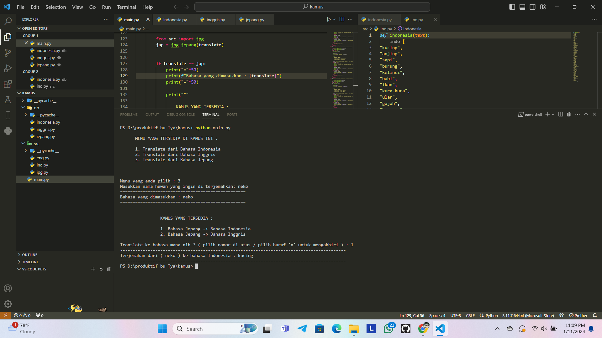

# Translate Python based CLI 



Translator simple application that allows users to translate words or sentences from one language to another.

## How to Use

### Download using ZIP available on GitHub

1. Click on the CODE section (located in the top right corner).
2. Click on Download ZIP.

### Download using terminal

1. Ensure you have Python and pip installed on your computer.
2. Clone this repository:

   - ```bash
     git clone https://github.com/alfajarjaya/translate-CLI.git

     Change to the project directory:
        cd translate-CLI


### Running the Application

1. Run the application:
   - python main.py
   
   
### Usage

1. select the available menu
2. enter the word you want to translate
3. select language
4. see result

## Contact

If you have any questions or suggestions, please contact me at [alfajjar123@gmail.com.]